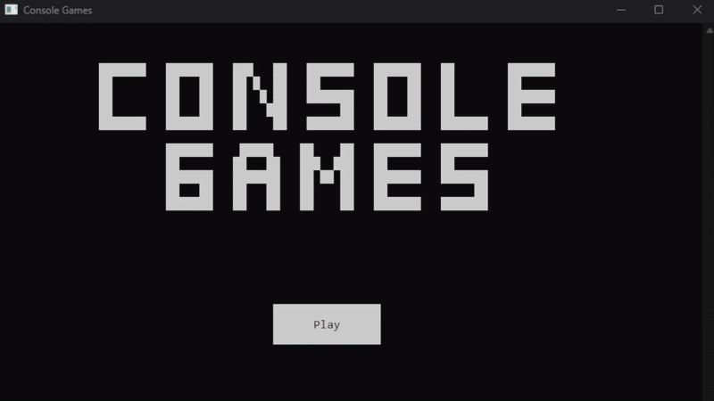
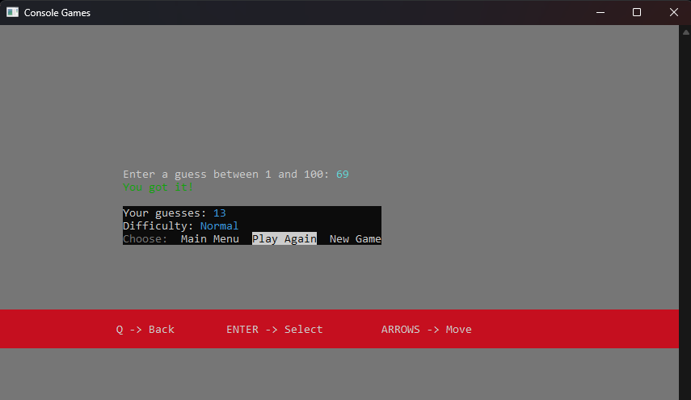
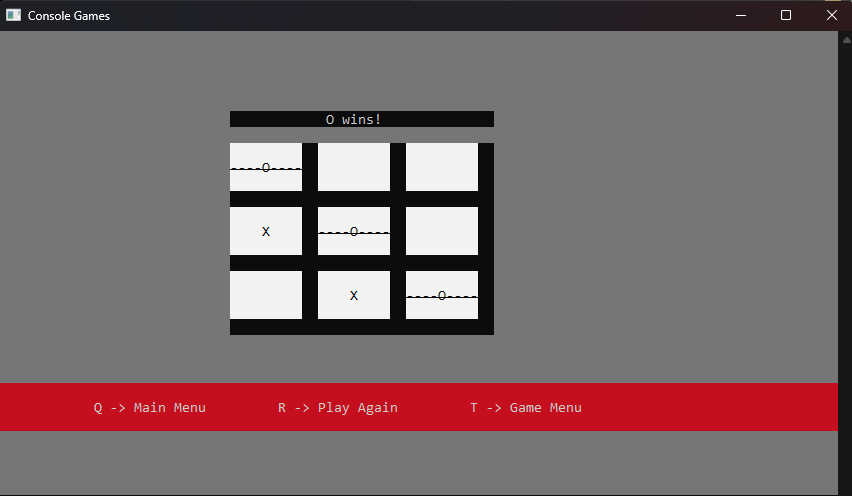

# Console Games
</img>

An application to be run by a command line and it contains 2 command line games.  
### How to build: (Building requires Windows)
1. Install Makefile from MinGW or Chocolatey. 
2. Install GCC from MinGW or TDM-GCC. 
3. Run the batch file to build. 
   It should take about 5 seconds. 
4. Open the compiled EXE (if it didn't open) 

### What I used: 
1. Requirements: Makefile and GCC 
2. My IDE is Dev-C++ 

# Games
<h2>Guessing Game</h2>
Difficulties: 
- Easy: Random number between 1 and 50 
- Normal: Random number between 1 and 100 
- Hard: Random number between 1 and 250 
- Insane: Random number between 1 and 1000 
 
</img>

<h2>Tic Tac Toe (2 Player)</h2>
Modes: Player vs Player 
Use arrow keys to move between cells. 
 
</img>
